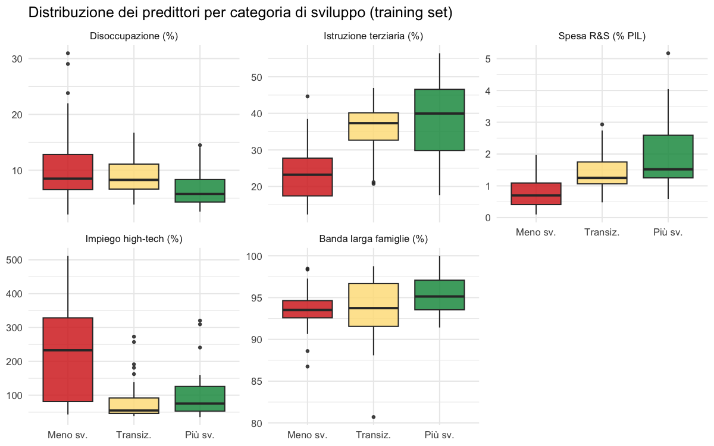
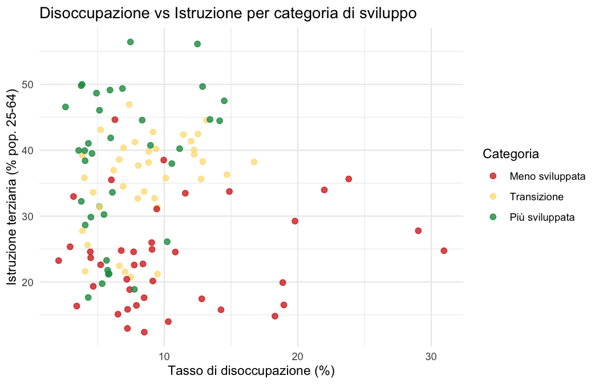
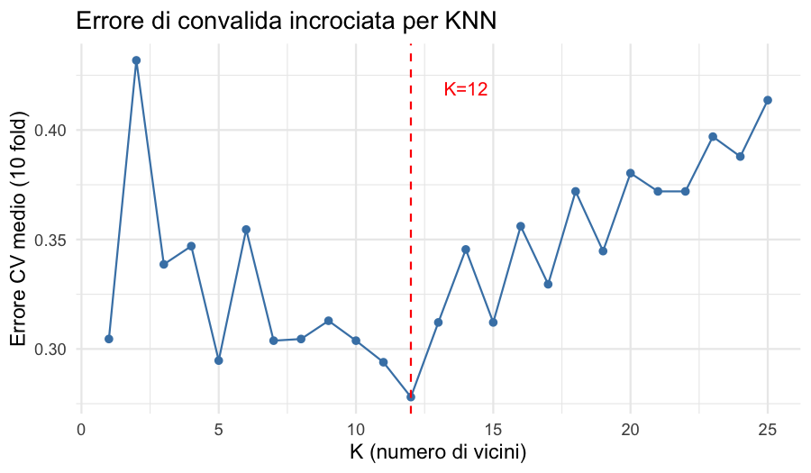
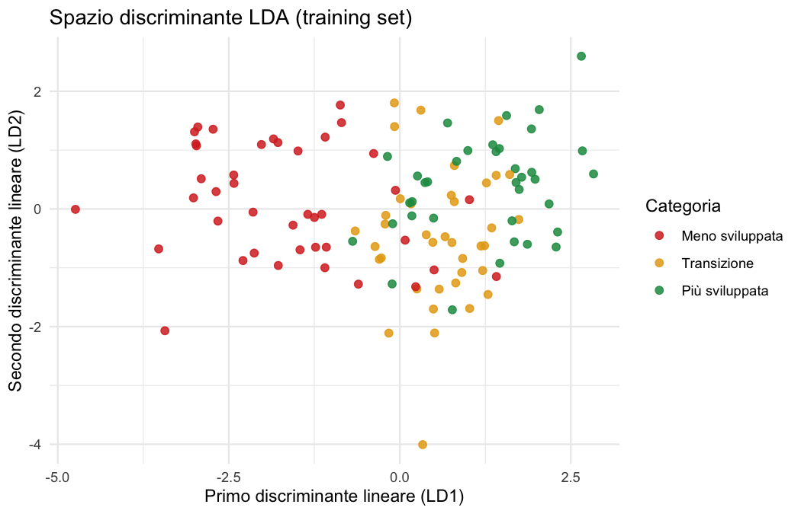

```{r setup, include=FALSE}
knitr::opts_chunk$set(echo = FALSE, message = FALSE, warning = FALSE,
                      fig.align = "center", out.width = "92%")
library(dplyr)
library(ggplot2)
library(knitr)
library(caret)
```

# Introduzione

La politica di coesione dell'Unione Europea è uno dei principali strumenti
di intervento per ridurre le disparità economiche e sociali tra le regioni
degli Stati membri. Ogni ciclo di programmazione, l'UE classifica le regioni
NUTS-2 in tre categorie — *meno sviluppate*, *in transizione* e *più
sviluppate* — in base al PIL pro capite in parità di potere d'acquisto (PPS)
rispetto alla media UE, e assegna i fondi strutturali di conseguenza.

**Obiettivo.** Costruire un modello di classificazione che predica la
categoria di sviluppo di una regione NUTS-2 a partire da indicatori
socioeconomici *diversi dal PIL* — disoccupazione, istruzione, innovazione,
digitalizzazione — e valutarne la capacità predittiva su regioni non viste
durante l'addestramento.

L'interesse pratico è duplice: da un lato verificare se e in che misura la
categoria di sviluppo sia *leggibile* da questi indicatori strutturali (senza
conoscere il PIL direttamente), dall'altro identificare quali dimensioni del
divario regionale sono più discriminanti.

**Fonte dei dati.** I dati provengono dall'ufficio statistico ufficiale
dell'Unione Europea, **Eurostat**, tramite il pacchetto R `eurostat` che
interroga direttamente l'API Eurostat:

\small
`https://ec.europa.eu/eurostat/api/dissemination/sdmx/2.1/data/{codice_dataset}`
\normalsize

I dataset utilizzati sono tutti della serie `tgs00xxx` (Regional indicators,
anno di riferimento 2021) e `isoc_r_broad_h`.

---

# I Dati

## Variabili

```{r load, results='hide'}
source("R/01_load_data.R")
train <- read.csv("data/regions_train.csv", stringsAsFactors = FALSE)
test  <- read.csv("data/regions_test.csv",  stringsAsFactors = FALSE)
lvls  <- c("meno_sviluppata","transizione","piu_sviluppata")
train$dev_class <- factor(train$dev_class, levels = lvls)
test$dev_class  <- factor(test$dev_class,  levels = lvls)
all_data <- rbind(train, test)
all_data$dev_class <- factor(all_data$dev_class, levels = lvls)
```

| Variabile Eurostat | Nome nel modello | Unità | Ruolo |
|---|---|---|---|
| `tgs00006` (GDP PPS) | — | % media UE | **Definisce la classe** (non usato come predittore) |
| `tgs00010` | `unemp_rate` | % | Tasso di disoccupazione |
| `tgs00109` | `educ_tertiary` | % pop. 25-64 | Istruzione terziaria |
| `tgs00042` | `rnd_gdp_pct` | % PIL | Spesa R&S |
| `tgs00059` | `hitech_emp_pct` | % | Occupazione high-tech |
| `isoc_r_broad_h` | `broadband_pct` | % famiglie | Accesso banda larga |

Il PIL pro capite (PPS) è utilizzato esclusivamente per definire la variabile
risposta secondo le soglie ufficiali UE (< 75% = meno sviluppata; 75–100% =
transizione; > 100% = più sviluppata) e viene poi rimosso dai predittori.
Ciò rende il problema di classificazione non banale: i predittori misurano
*dimensioni strutturali* diverse dal reddito diretto.

## Campione e distribuzione delle classi

Il dataset comprende **`r nrow(all_data)` regioni NUTS-2** di 23 paesi UE
(anno 2021), con dati completi per tutti e cinque i predittori. La
partizione è 75% training (`r nrow(train)` regioni) e 25% test
(`r nrow(test)` regioni), con seme fisso per riproducibilità.

```{r class-dist}
tab <- as.data.frame(table(all_data$dev_class))
colnames(tab) <- c("Classe","N regioni")
tab$Classe <- c("Meno sviluppata","Transizione","Più sviluppata")
kable(tab,
      caption = "Distribuzione delle classi nel dataset completo. Le classi sono quasi perfettamente bilanciate.",
      booktabs = TRUE, row.names = FALSE)
```

## Analisi esplorativa

```{r eda, results='hide'}
source("R/02_eda.R")
```

```{r fig-box, fig.cap="Distribuzione dei predittori per categoria di sviluppo (training set). Le regioni meno sviluppate mostrano disoccupazione più alta, istruzione e R\\&S più basse. La classe transizione occupa una posizione intermedia ma con ampia sovrapposizione."}

```

```{r fig-scatter, fig.cap="Disoccupazione vs istruzione terziaria per categoria di sviluppo. La separazione tra regioni meno sviluppate (rosso) e più sviluppate (verde) è netta, mentre le regioni in transizione (giallo) si sovrappongono a entrambe — motivando l'uso di metodi multivariati."}

```

```{r cor-table}
cor_mat <- read.csv("output/cor_matrix.csv", row.names = 1)
rownames(cor_mat) <- c("Disoccup.","Educ. terz.","R\\&S","High-tech","Banda larga")
colnames(cor_mat) <- rownames(cor_mat)
kable(cor_mat, digits = 2,
      caption = "Matrice di correlazione tra i predittori (training set). Le correlazioni moderate indicano assenza di multicollinearità grave.",
      booktabs = TRUE)
```

---

# Costruzione dei Modelli

Vengono applicati tre classificatori al problema multiclasse (3 categorie):

- **KNN** (*K-nearest neighbors*): classificatore non parametrico; il numero
  di vicini $K$ è selezionato tramite convalida incrociata a 10 gruppi sul
  solo insieme di addestramento.
- **LDA** (*Linear Discriminant Analysis*): classificatore parametrico che
  assume distribuzioni gaussiane con matrice di covarianza comune alle classi
  e frontiere di decisione lineari.
- **QDA** (*Quadratic Discriminant Analysis*): estensione di LDA che consente
  matrici di covarianza diverse per classe, producendo frontiere quadratiche.

Tutti i predittori sono **standardizzati** (media 0, deviazione standard 1)
prima dell'applicazione di KNN (obbligatorio per la distanza euclidea) e di
LDA/QDA (per confrontabilità dei coefficienti discriminanti).

```{r modeling, results='hide'}
source("R/03_modeling.R")
```

## Selezione di K per KNN tramite convalida incrociata

```{r fig-cv, fig.cap="Errore di convalida incrociata a 10 gruppi al variare di K (KNN). Il valore ottimale minimizza l'errore CV sul training set; il test set non viene mai coinvolto in questa fase."}

```

```{r cv-table}
cv_res <- read.csv("output/knn_cv_results.csv")
best_K <- cv_res$K[which.min(cv_res$cv_error)]
```

La convalida incrociata seleziona $K =$ **`r best_K`**, con errore CV
medio di `r round(min(cv_res$cv_error), 3)`. La curva CV (Figura 3) mostra
il tipico **dilemma bias-varianza**: per $K$ piccoli (modello flessibile,
basso bias ma alta varianza) l'errore CV è elevato; al crescere di $K$ il
modello si regolarizza e l'errore diminuisce fino al minimo, per poi
aumentare di nuovo quando il modello diventa troppo rigido.

---

# Valutazione dei Modelli

```{r eval-plots, results='hide'}
source("R/04_evaluation.R")
```

## Accuratezza e metriche per classe

```{r comparison}
comp <- read.csv("output/model_comparison.csv")
kable(comp,
      col.names = c("Modello","Accuratezza","Sensitività (media)","Specificità (media)"),
      caption = "Confronto tra i classificatori sul test set (39 regioni). Accuratezza globale e medie macro di sensitività e specificità per classe.",
      booktabs = TRUE, digits = 3)
```

**LDA** ottiene la migliore accuratezza (`r round(comp$Accuratezza[comp$Modello=="LDA"],3)*100`%) e le migliori metriche medie. Questo suggerisce che le tre classi siano approssimativamente separabili con frontiere *lineari* nello spazio dei predittori, coerentemente con la struttura delle politiche UE che definisce soglie su una scala ordinale di sviluppo. QDA (`r round(comp$Accuratezza[comp$Modello=="QDA"],3)*100`%) migliora su KNN ma non supera LDA, indicando che la maggiore flessibilità di QDA non compensa il costo in varianza con questo campione. KNN (`r round(comp$Accuratezza[comp$Modello=="KNN"],3)*100`%) è il meno accurato: la distanza euclidea con pochi dati in 5 dimensioni soffre della *maledizione della dimensionalità*.

## Matrici di confusione

```{r fig-cms, fig.show='hold', out.width='33%', fig.cap="Matrici di confusione sul test set per KNN (sinistra), LDA (centro) e QDA (destra). La classe 'Transizione' è la più difficile da classificare in tutti i metodi, per la sua natura intermedia."}
knitr::include_graphics(c("figures/cm_knn.png","figures/cm_lda.png","figures/cm_qda.png"))
```

In tutti e tre i modelli, la classe *meno sviluppata* è classificata con la
maggiore accuratezza (regioni dell'Europa orientale hanno profili
socioeconomici distinti), mentre la classe *transizione* produce più
classificazioni errate verso le classi adiacenti — un risultato
interpretabile: le regioni di transizione sono per definizione quelle più
simili a entrambe le categorie confinanti.

## Spazio discriminante LDA

```{r fig-lda, fig.cap="Proiezione delle regioni di training nello spazio dei due discriminanti lineari LDA. LD1 separa principalmente le regioni meno sviluppate da quelle più sviluppate; LD2 differenzia la classe di transizione."}

```

---

# Conclusioni

L'analisi mostra che è possibile predire la categoria di sviluppo EU di una
regione NUTS-2 con buona accuratezza (**`r round(max(comp$Accuratezza),3)*100`% con LDA**) usando esclusivamente indicatori strutturali non direttamente legati al PIL: disoccupazione, istruzione, R&S, occupazione high-tech e connettività a banda larga.

Il modello LDA risulta superiore agli altri, confermando che la struttura del
problema è approssimativamente lineare nello spazio di questi predittori —
coerentemente con la logica della politica di coesione UE, che definisce
soglie lineari sul PIL per assegnare le categorie.

Le principali difficoltà di classificazione riguardano le regioni di
*transizione*, che per costruzione sono quelle più simili alle altre due
categorie. La classe *meno sviluppata* è invece classificata quasi
perfettamente: le regioni dell'Europa orientale presentano profili
strutturalmente distinti da quelli dell'Europa occidentale.

**Implicazioni.** Un modello di questo tipo potrebbe essere utilizzato per
monitorare *convergenza reale*: una regione che viene riclassificata
correttamente da indicatori strutturali (senza usare il PIL) sta mostrando
una coerenza tra crescita economica e sviluppo dei capitali umano e
tecnologico. Una misclassificazione sistematica potrebbe invece segnalare
disallineamenti strutturali che richiedono politiche mirate.

**Limitazioni.** Il campione è limitato a 155 regioni con dati completi
(alcune regioni periferiche o di piccole dimensioni sono escluse per
mancanza di dati). La classificazione è basata su un singolo anno (2021) e
non cattura la dinamica temporale del processo di convergenza.

---

\newpage
# Appendice: Codice R

```{r code-01, echo=TRUE, eval=FALSE, code=readLines("R/01_load_data.R")}
```

```{r code-02, echo=TRUE, eval=FALSE, code=readLines("R/02_eda.R")}
```

```{r code-03, echo=TRUE, eval=FALSE, code=readLines("R/03_modeling.R")}
```

```{r code-04, echo=TRUE, eval=FALSE, code=readLines("R/04_evaluation.R")}
```
